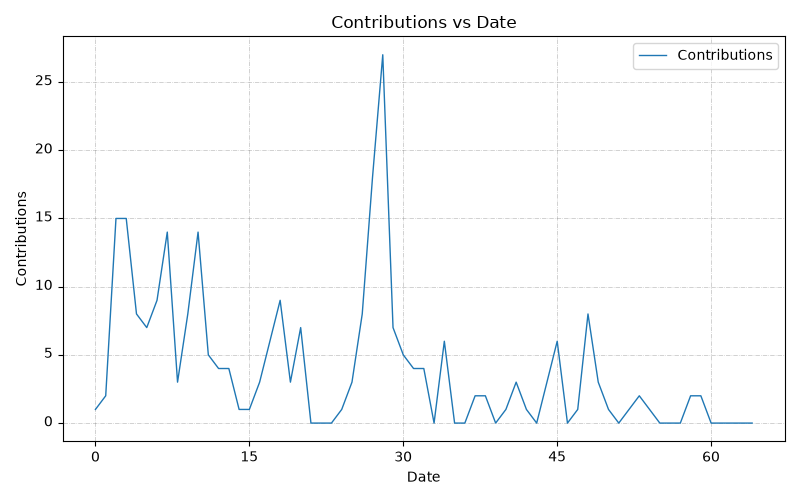

## Contact

Feel free to contact if you want me to be involved into your project:

- [e-mail](mailto:ales.tsurko@gmail.com)
- [Telegram](https://t.me/alestsurko)

## Stats

Updated daily.

***Top Languages By Contributions***

Io, C, Rust, JavaScript, Shell, HTML, VimScript, Lua, Dockerfile, SuperCollider, Objective-C, Makefile, XML, WGSL, TypeScript, Slint, Python, Nix, EmacsLisp, CSS, C++.

Number of contributions yesterday: **4**.

***Most Popular***

- [cells](https://github.com/ales-tsurko/cells)
- [LearningCoreAudioWithSwift2.0](https://github.com/ales-tsurko/LearningCoreAudioWithSwift2.0)
- [microscale](https://github.com/ales-tsurko/microscale)
- [kotoist](https://github.com/ales-tsurko/kotoist)
- [eerie](https://github.com/IoLanguage/eerie)

***Recently Starred***

- [nvim-noirbuddy](https://github.com/jesseleite/nvim-noirbuddy)
- [render-markdown.nvim](https://github.com/MeanderingProgrammer/render-markdown.nvim)
- [incline.nvim](https://github.com/b0o/incline.nvim)
- [nvim-luapad](https://github.com/rafcamlet/nvim-luapad)
- [markview.nvim](https://github.com/OXY2DEV/markview.nvim)

