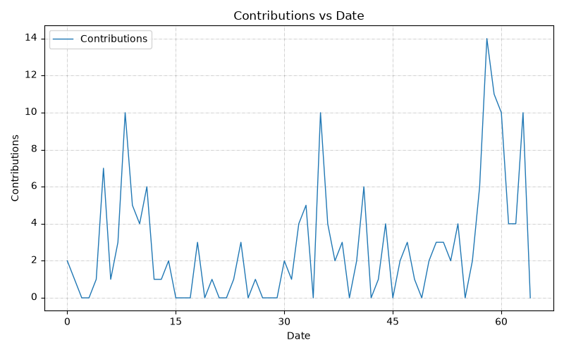

## Contact

Feel free to contact if you want me to be involved into your project:

- [e-mail](mailto:ales.tsurko@gmail.com)
- [Telegram](https://t.me/alestsurko)

## Stats

Updated daily.

***Top Languages By Contributions***

Io, C, Rust, JavaScript, Makefile, HTML, Shell, SuperCollider, Objective-C, CSS, VimScript, Python, XML, WGSL, TypeScript, LilyPond, Java, GLSL.

Number of contributions yesterday: **0**.

***Most Popular***

- [cells](https://github.com/ales-tsurko/cells)
- [LearningCoreAudioWithSwift2.0](https://github.com/ales-tsurko/LearningCoreAudioWithSwift2.0)
- [microscale](https://github.com/ales-tsurko/microscale)
- [kotoist](https://github.com/ales-tsurko/kotoist)
- [eerie](https://github.com/IoLanguage/eerie)

***Recently Starred***

- [fastctx](https://github.com/yc-duan/fastctx)
- [celld](https://github.com/denoland/celld)
- [tuicr](https://github.com/agavra/tuicr)
- [topcoat](https://github.com/tokio-rs/topcoat)
- [koto-library](https://github.com/jb-perrier/koto-library)

