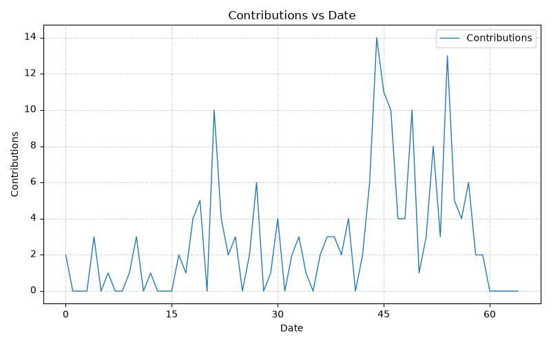

## Looking For Rust Engineering Roles

If you want me to be involved into your project, feel free to reach out via [e-mail](mailto:ales.tsurko@gmail.com).

Location: Poland - Remote, Hybrid; anywhere else - Remote. I can consider relocation within EU or North America if you provide visa sponsorship or legal support.

Preferable areas: audio, GUI applications, local-first applications, developer tools, backend.

## Stats

Updated daily.

***Languages By Contributions***

Io, C, Rust, JavaScript, Makefile, HTML, Shell, SuperCollider, Python, Objective-C, CSS, VimScript, Lua, Java, XML, WGSL, TypeScript, LilyPond, GLSL, C++.

Number of contributions yesterday: **6**.

***Most Popular Repos***

- [cells](https://github.com/ales-tsurko/cells)
- [LearningCoreAudioWithSwift2.0](https://github.com/ales-tsurko/LearningCoreAudioWithSwift2.0)
- [microscale](https://github.com/ales-tsurko/microscale)
- [kotoist](https://github.com/ales-tsurko/kotoist)
- [eerie](https://github.com/IoLanguage/eerie)

***Recently Starred***

- [kodo](https://github.com/rfunix/kodo)
- [linkly](https://github.com/choiyounggi/linkly)
- [rivet](https://github.com/rivet-dev/rivet)
- [rye](https://github.com/refaktor/rye)
- [Rebol3](https://github.com/Oldes/Rebol3)

