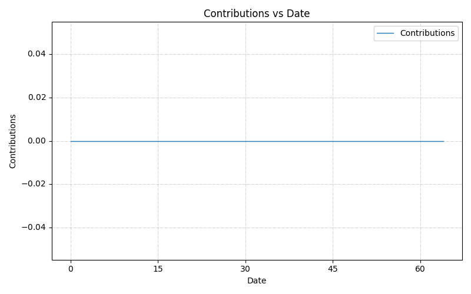

## Contact

Feel free to contact if you want me to be involved into your project:

- [e-mail](mailto:ales.tsurko@gmail.com)
- [Telegram](https://t.me/alestsurko)

## Stats

Updated daily.

***Top Languages By Contributions***

Io, C, Rust, HTML, JavaScript, Objective-C, SuperCollider, VimScript, Shell, Python, CSS, XML, Swift, Makefile, Lua, LilyPond, GLSL, Dockerfile.

Number of contributions yesterday: **0**.

***Most Popular***

- [cells](https://github.com/ales-tsurko/cells)
- [LearningCoreAudioWithSwift2.0](https://github.com/ales-tsurko/LearningCoreAudioWithSwift2.0)
- [microscale](https://github.com/ales-tsurko/microscale)
- [kotoist](https://github.com/ales-tsurko/kotoist)
- [eerie](https://github.com/IoLanguage/eerie)

***Recently Starred***

- [waterui](https://github.com/water-rs/waterui)
- [spritefusion-pixel-snapper](https://github.com/Hugo-Dz/spritefusion-pixel-snapper)
- [Fabric](https://github.com/Fabric-Project/Fabric)
- [Astra](https://github.com/ArkForgeLabs/Astra)
- [ravynos](https://github.com/ravynsoft/ravynos)

